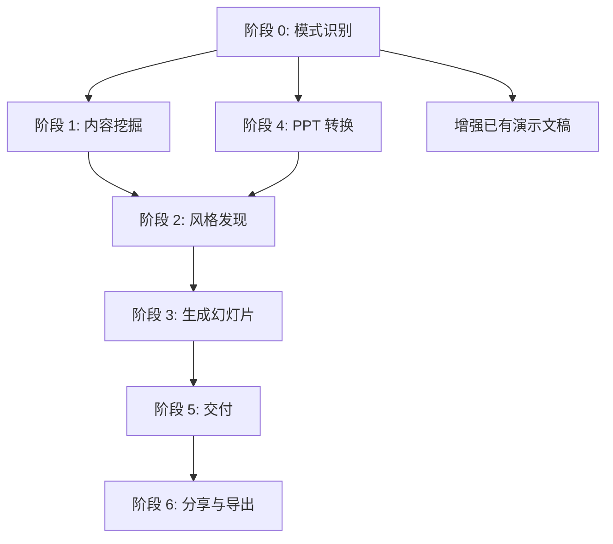

# Frontend Slides（前端幻灯片）

一款用于 Claude Code 的技能（Skill），帮助你从零创建、或者基于 PowerPoint 文件转换生成**充满动画效果的精美 HTML 演示文稿**。

## 项目简介

**Frontend Slides** 让不懂设计的人也能快速打造出高质量的网页演示文稿 —— 完全不需要懂 CSS 或 JavaScript。它采用 **"Show, Don't Tell"（以示代述）** 的核心理念：不让你用语言去描述抽象的设计偏好，而是直接生成多个可视化预览，让你通过"挑选自己喜欢的"来完成风格选择。

本仓库中就有一段**通过该技能本身制作的**演示视频作为示例：

https://github.com/user-attachments/assets/ef57333e-f879-432a-afb9-180388982478

### 核心特性

| 特性 | 说明 |
| --- | --- |
| **零依赖（Zero Dependencies）** | 单个 HTML 文件，CSS/JS 全部内联。无需 npm、构建工具或任何框架。 |
| **视觉风格发现（Visual Style Discovery）** | 无法用语言描述审美偏好？没问题 —— 从系统生成的视觉预览中直接挑选即可。 |
| **PPT 转换** | 将现有 PowerPoint 文件转为网页幻灯片，保留全部文字、图片和备注。 |
| **反 AI Slop 设计（Anti-AI-Slop）** | 精心挑选出有辨识度的风格，避免千篇一律的"AI 味"审美（告别白底紫色渐变）。 |
| **生产级质量** | 代码可访问、响应式、注释清晰，可随意二次定制。 |

---

## 安装方式

### 方式一：通过 Claude Code 插件市场安装（推荐）

在 Claude Code 中执行两条命令即可：

```bash
/plugin marketplace add zarazhangrui/frontend-slides
/plugin install frontend-slides@frontend-slides
```

随后在 Claude Code 中输入 `/frontend-slides` 即可使用。

### 方式二：手动安装

将技能文件复制到 Claude Code 的 skills 目录：

```bash
# 创建技能目录
mkdir -p ~/.claude/skills/frontend-slides/scripts

# 复制所有必需文件（或直接克隆本仓库）
cp SKILL.md STYLE_PRESETS.md viewport-base.css html-template.md animation-patterns.md ~/.claude/skills/frontend-slides/
cp scripts/extract-pptx.py ~/.claude/skills/frontend-slides/scripts/
```

或者直接克隆仓库：

```bash
git clone https://github.com/zarazhangrui/frontend-slides.git ~/.claude/skills/frontend-slides
```

完成后在 Claude Code 中使用 `/frontend-slides` 启动。

---

## 使用方法

### 场景一：从零创建新演示文稿

```
/frontend-slides

> "帮我做一份 AI 初创公司的路演 PPT"
```

技能会按以下流程引导你：

1. 询问演示内容（幻灯片主题、关键信息、图片素材等）
2. 询问你希望观众产生的情绪体验（被震撼？被激励？冷静专注？）
3. 生成 **3 种可视化风格预览**供你对比挑选
4. 根据你选择的风格生成完整的演示文稿
5. 自动在浏览器中打开展示

### 场景二：转换 PowerPoint 文件

```
/frontend-slides

> "把 presentation.pptx 转成网页幻灯片"
```

执行流程：

1. 从 PPT 中抽取全部文字、图片和演讲备注
2. 向你确认抽取到的内容清单
3. 让你挑选视觉风格
4. 生成保留原始素材的 HTML 演示文稿

### 场景三：增强已有的 HTML 演示文稿

直接让 Claude 打开现有的 HTML 演示文稿进行优化即可。技能会在**不破坏视口适配规则**的前提下，主动分析内容密度、自动拆分过长的幻灯片。

---

## 12 种内置视觉风格

### 深色主题（Dark Themes）

| 风格 | 特征 |
| --- | --- |
| **Bold Signal** | 自信、高冲击力，深色背景上的鲜艳色块卡片（Archivo Black + Space Grotesk） |
| **Electric Studio** | 简洁专业的上下分栏，白 + 蓝撞色（Manrope） |
| **Creative Voltage** | 活力充沛的复古现代风，电光蓝 + 霓虹黄（Syne + Space Mono） |
| **Dark Botanical** | 精致优雅的暗调，抽象柔和渐变圆 + 暖色（Cormorant + IBM Plex Sans） |

### 浅色主题（Light Themes）

| 风格 | 特征 |
| --- | --- |
| **Notebook Tabs** | 编辑感强的笔记本纸张质感，右侧彩色标签页（Bodoni Moda + DM Sans） |
| **Pastel Geometry** | 亲和力十足的柔色几何，右侧垂直药丸条（Plus Jakarta Sans） |
| **Split Pastel** | 活泼现代的双色纵向分屏：桃色 + 薰衣草紫（Outfit） |
| **Vintage Editorial** | 机智有态度的复古编辑风，抽象几何配饰（Fraunces + Work Sans） |

### 特色主题（Specialty Themes）

| 风格 | 特征 |
| --- | --- |
| **Neon Cyber** | 未来感强的赛博风，粒子背景 + 霓虹发光（Clash Display + Satoshi） |
| **Terminal Green** | 开发者向黑客审美，终端绿 + 扫描线（JetBrains Mono） |
| **Swiss Modern** | Bauhaus 风格的极简几何，黑 / 白 / 红配色（Archivo + Nunito） |
| **Paper & Ink** | 书卷气的文学编辑风，首字下沉 + 引言排版（Cormorant Garamond） |

每种风格都定义了完整的字体、颜色、版式和标志性装饰元素，详情见 [`STYLE_PRESETS.md`](STYLE_PRESETS.md)。

---

## 架构设计：渐进式披露（Progressive Disclosure）

本技能遵循 [OpenAI Harness Engineering](https://openai.com/index/harness-engineering/) 理念 —— **"给 Agent 一张地图，而不是一本 1000 页的说明书"**。

主入口 `SKILL.md` 只是一份约 180 行的精简地图，其它支持文件按需懒加载：

| 文件 | 用途 | 加载时机 |
| --- | --- | --- |
| [`SKILL.md`](SKILL.md) | 核心工作流和设计规则（入口） | 启动技能时始终加载 |
| [`STYLE_PRESETS.md`](STYLE_PRESETS.md) | 12 种视觉风格预设的完整定义 | 阶段 2：风格选择 |
| [`viewport-base.css`](viewport-base.css) | 必须内嵌的响应式基础 CSS | 阶段 3：生成 HTML |
| [`html-template.md`](html-template.md) | HTML 结构与 JS 功能参考 | 阶段 3：生成 HTML |
| [`animation-patterns.md`](animation-patterns.md) | CSS/JS 动画模式参考库 | 阶段 3：生成 HTML |
| [`scripts/extract-pptx.py`](scripts/extract-pptx.py) | PowerPoint 内容抽取脚本 | 阶段 4：PPT 转换 |
| [`scripts/deploy.sh`](scripts/deploy.sh) | 一键部署到 Vercel | 阶段 6：分享 |
| [`scripts/export-pdf.sh`](scripts/export-pdf.sh) | 幻灯片导出为 PDF | 阶段 6：分享 |

### 工作流阶段



- **阶段 0 — 模式识别**：判断用户想要新建、转换 PPT 还是增强已有文稿
- **阶段 1 — 内容挖掘**：一次性问清用途、长度、内容状态、是否需要浏览器内编辑等关键问题；若提供图片则进行多模态评估并与文字内容**协同设计**大纲
- **阶段 2 — 风格发现**：基于情绪（自信 / 激昂 / 沉静 / 感动）生成 3 个**单页可视化预览**到 `.claude-design/slide-previews/`，让用户直接"看见"三种审美并挑选
- **阶段 3 — 生成幻灯片**：严格按 `viewport-base.css` + `html-template.md` + `animation-patterns.md` 生成完整的单文件 HTML
- **阶段 4 — PPT 转换**：调用 `extract-pptx.py` 抽取文字 / 图片 / 备注，再走阶段 2→3
- **阶段 5 — 交付**：清理预览目录、自动打开浏览器、告知用户快捷键和定制方法
- **阶段 6 — 分享与导出**：可选地部署到 Vercel 或导出 PDF

---

## 关键设计约束（不可协商）

### 1. 视口严格适配（Viewport Fitting）

每一张幻灯片**必须**精确填充 100vh，**绝对不允许**在幻灯片内部出现滚动条。内容超出？立刻拆分为多张幻灯片。

- 所有 `.slide` 元素必须设置 `height: 100vh; height: 100dvh; overflow: hidden;`
- 所有字号与间距必须使用 `clamp(min, preferred, max)`，**禁用固定 px/rem**
- 图片：`max-height: min(50vh, 400px)`
- 必须为 700px / 600px / 500px 高度设置断点
- 必须支持 `prefers-reduced-motion` 无障碍偏好
- 禁止直接对 CSS 函数加负号（如 `-clamp()` 会被浏览器静默忽略）—— 必须写成 `calc(-1 * clamp(...))`

### 2. 单页内容密度上限

| 幻灯片类型 | 最大内容量 |
| --- | --- |
| 标题页 | 1 个主标题 + 1 个副标题 + 可选标语 |
| 内容页 | 1 个标题 + 4–6 条要点 或 1 个标题 + 2 段正文 |
| 功能网格 | 1 个标题 + 最多 6 张卡片（2×3 或 3×2） |
| 代码页 | 1 个标题 + 8–10 行代码 |
| 引言页 | 1 段引言（≤3 行）+ 署名 |
| 图片页 | 1 个标题 + 1 张图片（≤60vh 高度） |

**超出密度？拆分成多页，绝不挤压，绝不滚动。**

### 3. 反 "AI Slop" 审美

- **禁用字体**：Inter、Roboto、Arial、系统字体作为展示字体
- **禁用配色**：泛滥的靛紫 `#6366f1`、白底紫色渐变
- **禁用装饰**：写实插画、滥用玻璃拟态、无意义阴影
- **字体必须来自** Fontshare 或 Google Fonts，永不使用系统字体

---

## 分享你的演示文稿

生成结束后，技能会主动询问你是否需要分享。提供两种方式：

### 方式 A：一键部署到可访问链接（Vercel）

获得一个永久可用的公共 URL，在手机、平板、电脑上都能正常展示：

```bash
bash scripts/deploy.sh ./my-deck/
# 或者
bash scripts/deploy.sh ./presentation.html
```

基于 [Vercel](https://vercel.com) 免费套餐。如果是首次使用，脚本会引导你完成注册、登录。脚本会：

1. 检查 Vercel CLI 是否已安装，未安装则自动安装
2. 检查登录状态，未登录则引导交互式登录
3. 若输入为单个 HTML 文件，会自动解析 `src` / `href` / `url()` 引用并打包本地资源
4. 部署到以项目名命名的生产 URL，并输出可分享链接

> ⚠️ **注意事项**
> - 本地引用的图片 / 视频必须随 HTML 一同上传。强烈建议使用**文件夹部署**（HTML + 资源在同一目录）
> - 文件名避免空格，使用连字符代替
> - 重复部署会覆盖同一个 URL，无需更换链接

### 方式 B：导出为 PDF

便于邮件、Slack、Notion 或打印：

```bash
bash scripts/export-pdf.sh ./my-deck/index.html
bash scripts/export-pdf.sh ./presentation.html ./output.pdf
bash scripts/export-pdf.sh ./presentation.html --compact   # 紧凑模式（1280×720，文件更小）
```

基于 [Playwright](https://playwright.dev) 实现，按需自动安装 Chromium（约 150MB，仅首次）。流程：

1. 启动临时本地 HTTP 服务（让字体和相对路径资源可加载）
2. 以 **1920×1080**（或紧凑模式 1280×720）打开演示
3. 逐一截取每一张 `.slide` 元素的静态图
4. 将所有截图合并成单一 PDF 并自动打开

> ⚠️ **注意事项**
> - 首次运行较慢（30–60 秒），需下载 Playwright + Chromium
> - 幻灯片类名必须是 `.slide`
> - 图片路径必须是**相对路径**，不能是绝对文件系统路径
> - 动画不会被保留，只捕获最终静态帧
> - 大型演示可能产生 20MB+ 的 PDF，可用 `--compact` 减小 50–70%

---

## 浏览器内联编辑（可选）

在阶段 1 中如果选择启用"浏览器内编辑"，生成的 HTML 会额外内置：

- 左上角的**隐藏热区**（hover 触发）或按下 `E` 键打开编辑模式
- 所有文字变为 `contenteditable` 可直接点击编辑
- `Ctrl+S` 导出当前修改后的 HTML 文件
- 编辑状态自动保存到 `localStorage`

> 🔧 技术细节：`exportFile()` 在捕获 `outerHTML` 前会**临时清除所有编辑态**（如 `contenteditable` 属性、`edit-active` 类、UI 高亮等），导出后再恢复。这样保证下载得到的 HTML 打开时是干净的浏览状态，而不是永远卡在编辑模式。

---

## 设计哲学

1. **做漂亮的东西不需要你是设计师** —— 你只需要对所见之物做出反应。
2. **依赖即债务** —— 一个纯 HTML 文件在 10 年后还能打开；一个 2019 年的 React 项目？祝你好运。
3. **平庸等于被遗忘** —— 每一份演示都应该看起来是定制的，而不是模板生成的。
4. **注释是一种善意** —— 代码应向未来的自己（或任何打开它的人）解释自己。

---

## 环境要求

| 功能 | 依赖 |
| --- | --- |
| 基础使用 | [Claude Code](https://claude.ai/claude-code) CLI |
| PPT 转换 | Python + `python-pptx`（`pip install python-pptx`） |
| URL 部署 | Node.js + Vercel 账号（免费） |
| PDF 导出 | Node.js（Playwright 会自动安装） |
| 图片处理（可选） | `pip install Pillow` |

---

## 项目目录结构

```
ai-slides-skills/
├── .claude-plugin/
│   └── marketplace.json          # 插件市场元数据
├── plugins/frontend-slides/
│   └── .claude-plugin/
│       └── plugin.json           # 插件清单
├── scripts/
│   ├── deploy.sh                 # 一键部署到 Vercel
│   ├── export-pdf.sh             # HTML 转 PDF
│   └── extract-pptx.py           # PowerPoint 抽取器
├── SKILL.md                      # 技能主入口（工作流）
├── STYLE_PRESETS.md              # 12 种视觉风格定义
├── viewport-base.css             # 强制的响应式基础样式
├── html-template.md              # HTML 结构与 JS 功能模板
├── animation-patterns.md         # 动画模式参考库
├── README.md                     # 英文说明
└── README_CN.md                  # 本文件（中文说明）
```

---

## 致谢

由 [@zarazhangrui](https://github.com/zarazhangrui) 使用 Claude Code 创建。

灵感来源于 **"Vibe Coding"** 哲学 —— 即便不是传统意义的软件工程师，也能构建美丽的东西。

## 许可证

MIT —— 使用、修改、分享，自由。
